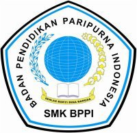

<!DOCTYPE html>
<html lang="en">
 <head>
      <meta charset="UTF-8">
      <meta name="viewport" content="width=device-width, initial-scale=1.0">
      <link rel="stylesheet" href="style.css">
      <title>Bab Tugas</title>
</head>
<body>
    

    <h2>PEMANFAATAN INTERNET DAN MULTIMEDIA DALAM PEMBELAJARAN DI SEKOLAH: Antara peluang dan Tantangan</h2>
	  
Oleh : Rafi

	  <h2>Kata Pengantar</h2>
         
	  

    
Kami mohon maaf jika di dalam makalah ini terdapat banyak kesalahan dan kekurangan, karena kesempurnaan hanya milik Yang Maha Kuasa yaitu Allah SWT, dan kekurangan pasti milik kita sebagai manusia. Semoga Makalah Internet ini dapat bermanfaat bagi kita semuanya.

	
	  </h2>
    <h2>Daftar isi</h2>
    <h3><a href="#awal"> Kata Pengantar</a></h3>
     <h2><a href="#bab1">BAB I  : PENDAHULUAN</a></h2>
   

 

  

     
<a href="#Latar">A. Latar Belakang</a>

 

   
<a href="#rumusan"> B. Rumusan Masalah</a>

    <h2><a href="#pembahasan">BAB II : PEMBAHASAN</a></h2>
     
<a href="#pengertian">A. Pengertian Internet</a>

     
<a href="#konsep">B. Teori Dan Konsep</a>

     
<a href="#masalah">C. Pokok Permasalahan</a>

     
<a href="#positif">D. Dampak Positif</a>

     
<a href="#negatif">E. Dampak Negatif</a>

   <h2><a href="#a">BAB III : KESIMPULAN</a></h2>
    
<a href="#b">A. Kesimpulan</a>

    
<a href="#c">B. Saran</a>

   <h3><a href="#d">DAFTAR PUSTAKA</a></h3>
  
  
 

  <h3 id="bab1">BAB I PENDAHULUAN</h3>
  

 

  

 

   

 

 <h4>Pendahuluan</h4>
  

  <h3>A. Latar Belakang</h3>

 
Dekade terakhir ini perkembangan yang pesat dalam teknologi Internet telah
mulai merasuk ke Indonesia. Sekalipun masih barang baru, Internet ternyata dapat
berkembang dengan pesat, terlihat dari jumlah perusahaan yang bergerak dalam
industri jasa <a href="https://doc.lalacomputer.com/makalah-internet/#A-Latar-Belakang">Internet</a>
semua aspek dari sektor pendidkan, bisnis dan ekonomi. Dalam dunia pendidikan dan
politik disinyalir bahwa kelompok-kelompok mahasiswa proreformasi telah
memanfaatkan Internet dan e-mail untuk berkomunikasi dan mengkoordinasikan
gerakan mereka di seluruh pelosok tanah air, sehingga perjuangan mereka berhasil
melengserkan Soeharto dari kekuasaannya dalam waktu yang menakjubkan
singkatnya.
Terlepas dari pengetahuan dan keterampilan seseorang dalam menggunakan
Internet, kenyataan acuan-acuan terhadap informasi via Internet berkembang pesat
dan semakin diakui. Stasiun televisi, perusahaan, koran dan majalah kini merasa
bangga bila dapat mencatumkan alamat situs web (website) mereka di iklan-iklan atau
kepala surat mereka. Terlepas dari apakah seseorang menggunakan Internet atau
tidak, kita mau tak mau harus menyadari bahwa kita tengah memasuki suatu zaman
informasi baru di mana Internet memakai peranan penting. Karena Internet telah
merasuki banyak lapangan dan kawasan kehidupan manusia tanpa dapat dicegah
mapun ditunda, kajian dan pemanfaatan teknologi ini sangat perlu memasuki dunia
pendidikan, tidak saja karena anak didik sudah atau nantinya akan berhadapan dengan
teknologi ini dalam kehidupannya, tetapi juga karena teknologi ini merupakan bagian
dari kehidupan modern. Oleh karena itu tulisan ini ingin membahas kemungkinan
penggunaan Internet dan multi media dalam dunia pendidikan di Indonesia dan
karena kajian ini meliputi bidang yang amat luas, maka tulisan ini membatasi diri
dengan mendiskusikan beberapa masalah penting dalam pengajaran bahasa asing via
Internet dan multi media sebagai pengajaran saja.
 

  
Pengajaran telah lama akrab dengan teknologi. Dalam tahun 60-an dan 70-an,
laboratorium bahasa banyak digunakan di lembaga-lembaga pendidikan dan secara
individu tape-recorder juga lazim digunakan baik oleh guru maupun siswa.
Pengajaran bahasa Inggris memalui radio juga telah menyumbang banyak ke dalam
kemajuan di bidang penghajran bahasa.
Di dalam lab-lab bahasa misalnya, kegiatan dan kemajuan setiap siswa yang
belajar pada booth masing-masing dimonitor oleh guru di ruang kontrol. Teknologi
ini dikembangkan berdasarkan pola tingkah laku rangsang-respon, sebuah teori
psikologi behavioris yang banyak dianut dalam pengajaran bahasa pada masa itu
dalam rangka teori ini dipercaya bahwa bertambah banyak siswa berlatih tambah
cepat mereka menguasai bahasa yang dituju.Sekali pun lab bahasa merupakan sumbangan yang positif terhadap bidang
pengajaran bahasa, namun beberapa kelemahannya kemudian terungkap. Ternyata
kegiatan-kegiatan dalam lab bahasa cepat membosankan siswa berhadapan dengan
pengalaman yang lebih abstrak dimana interaksinya dengan guru juga menjadi
minimal. Sekalipun siswa dapat belajar menurut kecepatan masing-masing, namun
pengajaran individual menjadi tidak relevan lagi, menyebabkan siswa yang tertinggal
menjadi frustasi. Lab bahasa tampaknya hanya mempunyai satu fungsi utama saja:
mendesiminasikan masukan bunyi (suara). Di samping kelemahan-kelemahan
pedagogis, peralatan lab bahasa ternyata juga mudah bertingkah, bahkan rusak.
Semua kelemahan ini, ditambah lagi dengan peralihan faham dalam pengajaran
bahasa ke pendekatan komunikatif serta perkembangan teknologi komputer,
kemudian melahirkan gagasan terhadap apa yang disebut sebagai belajar bahasa
dengan bantuan komputer (computer assisted language learning atau disingkat
CALL).

  <h3 id="rumusan">B. Rumusan Masalah</h3>
  
Internet justru merupakan suatu jaringan dari ribuan jaringan komputer yang
tersebar di seluruh dunia (Lewis, 1994). Setiap jaringan lokal memiliki kekhasan
masing-masing (bank-data, layanan informasi, perpustakaan, foto, grafik, jurnal
elektronik, dan lain sebagainya) dan kesemuanya ini ketika tergambung ke dalam
Internet, membentuk suatu akumulasi informasi teramat besar. Internet merupakan
jaringan komputer sedunia, yang masing-masingnya dapat saling menghubungi
melalui suatu sistem protokol standar yang berperan sebagai jembatan dari berbagai
sistem komputer yang berbeda-beda sehingga memungkinkan berbagai cara akses ke
Internet. Misalnya, seorang siswa pengguna IBM di Indonesia dapat berhubungan
dengan sebuah jaringan komputer di Australia yang menggunakan MacIntosh,
sekalipun sistem pengoperasian dari masing-masing komputer berbeda. Oleh karena
itu Internet dapat digunakan baik untuk pertukaran informasi melalui surat-elektronik
(sutronik), newsgroups, listservs, diskusi kelompok profesional yang on-line dan lain
sebagainya, mampu untuk mengakses informasi tentang berbagai topik melalui
jaringan sedunia (JKS) atau World Wide Web.

 

   
  

   <h2 id="pembahasan"> BAB II : PEMBAHASAN</h2>
    

  <h3 id="pengertian">A. Pengertian Internet</h3>
  
Internet adalah kumpulan dari jutaan komputer di seluruh dunia yang terkoneksi antara yang satu dengan yang lain. Media koneksi yang digunakan bisa melalui sambungan telepon, serat optik (fiber optic), kabel koaksial (coaxial cable), satelit atau dengan koneksi wireless. Ketika kita logon (dalam hal ini terhubung) dengan internet, kita diberikan hak akses ke komputer-komputer lain di seluruh dunia yang terhubung juga dengan internet. Dengan kemajuan teknologi yang semakin pesat, saat ini internet dapat dihubungi dengan koneksi wireless dari handheld PC atau dari sebuah komputer notebook. Setelah terhubung dengan internet kita dapat melakukan beberapa hal, misalnya mengirim dan menerima email, chating dengan media text atau suara, berselancar (surfing) di World Wide Web, atau hal-hal lain dengan suatu software aplikasi tertentu.
Secara sederhana, cara kerja Internet sama seperti sistem pos atau sistem pengantar parcel, kecuali Internet bekerja dengan sangat cepat.Misalnya, bila sekarang ini kita di Surabaya dan akan berkirim email ke Amerika, setelah kita tekan tombol Kirim (Send) selanjutnya email kita tadi akan menuju ke mail server. (Mail server ini biasanya bukanlah komputer yang sedang kita pakai saat ini, tetapi bagian dari layanan yang ada di Internet, sehingga kita bisa saja keluar dari Internet setelah menekan tombol Kirim tanpa mengganggu proses pengiriman email tersebut). Kemudian, mail server kita tersebut akan mencoba mengontak mail server di Amerika melewati rute Jakarta - Singapura - Jepang - Amerika atau bila rute tersebut sibuk dapat menngunakan rute Australia - Amerika.

  
Paket data dalam Internet memiliki ukuran tertentu sehingga bila email kita tadi cukup besar bisa saja dibagi dalam beberapa paket dan masing-masing paket dapat dikirim dengan rute yang berbeda. Setelah sampai di Amerika, mail server di sana akan membangun kembali email kita tersebut menjadi satu bagian utuh yang siap disajikan. Bila satelit yang digunakan dalam rute-rute tersebut sibuk maka mail server kita akan mencoba untuk mengirim kembali setelah beberapa saat sampai benar-benar terkirim. Bila sampai maksimum sampai 4 hari lebih (tergantung setting mail server kita) email itu belum bisa terkirim maka akan dikirimkan email pemberitahuan bahwa email kita tidak sampai.

  <h4 id="konsep">B. Teori Dan Konsep</h4>
  
Ngerumpi juga bisa dilakukan melalui sutronik. Dalam hal ini, dua atau lebih
  siswa didorong untuk omong-omong tentang berbagai topik atau isyu. Misalnya
  mereka diminta berdebat tentang isyu yang kontroversial seperti pacaran sembari
  belajar atau haruskah merokok dolarang di tempat-tempay umum?, dan lain
  sebagainya. Pengalaman-pengalaman ini merangsang kominikasi otentik, bukan
  komunikasi tiruan seperti yang biasa diciptakan di dalam kelas-kelas tradisonal.
  Semua ini menyumbang untuk dalam pembentukan keterampilan-keterampilan
  komunikasi yang khusus seperti berargumentasi, meyakinkan atau mempertahankan
  ide masing-masing. Berbeda dengan ngerumpi secara tatap muka (lisan), kegiatan
  ngerumpi tertulis ini memberikan kesempatan yang luas bagi peserta untuk berpikir,
  mengkonstruksi, mengacu pada bahan-bahan lain, dan lain sebagainya. Ketika ia
  menyusun argumentasinya karena ia tidak lagi begitu terikat pada waktu untuk
  merespon. Di damping itu dalam mengekspresikan diri ia boleh mengerahkan seluruh
  kemampuan bahasanya, ini juga dimungkinkan karena lebih bebasnya ia dari dimensi
  waktu. Sementara berdiskusi atau berdebat, siswa dapat didorong untuk
  memanfaatkan lautan informasi dalam berbagai listservs, yaitu semacam jaringan
  khusus paguyuban yang membahasa masalah-masalah tertentu, yang tersebar di
  seluruh dunia (via Internet). Listserver ini menerima dan mengirimkan kembali
  sutronik dari anggota kepada seluruh peserta paguyuban, lengkap dengan subyek
  masing-masing sehingga peserta dapat memilih topik yang diinginkannya.
  Sutronik juga digunakan untuk komunikasi jarak jauh dengan siswa di negara
  lain. Chang (1993) melakukan kajian tentang potensi penggunaan sutronik untuk
  memperbaiki kemampuan menulis dalam bahasa target. Tujuan kajian adalah untuk
  memberikan konteks alami dalam menulis, membantu mereka mengembangkan
  gagasan dalam membaca/memahami kawasan konten (content-area) dan menulis
  fungsional melewati batas-batas kultural, membiasakan siswa dengan telekomunikasi
  terhadap akuisisi bahasa tulisan (Davis & Chang, 1994). Dalam kajian ini Chang
  melibatkan mahasiswa S1 dari Taiwans National Kaohsiung Normal University
  (NKNU) dan mahasiswa Iniversity of North Carolina at Charlotte (UNCC) dalam
  sebuah koperensi jarak jauh (teleconference) selama 8 minggu.

  <h3 id="masalah">C. Pokok Permasalahan</h3>
  
Sejak hadirnya situs jejaring sosial
    pertemanan seperti facebook dan sejumlah sosmen lainnya banyak diantaranya yang
    enggan untuk ketemu dan bertatap muka. Ada juga yang bela-belain untuk video
    call via skype live streaming by phone ketika hendak berdiskusi.
    Budaya sosmed ini merambah hampir
    semua kalangan, mulai dari anak-anak hingga kakek nenek. Tidak cukup itu,
    budaya sosmed ini melahirkan kebiasaan introvert baru. budaya
    ini akan terus berlanjut hingga batas waktu yang tidak ditentukan, bisa saja
    semakin berkambang dan mengakar. Jika sudah begini Pemerintah juga akan turut
    campur, terutama untuk mengungkap 180 ribu akun twitter penebar kekerasan di
    sosmed.

    
Dapat dikatakan saraf
      malu sudah banyak terputus, sehingga tidak tahu malu menjadi tren tersendiri.
      Bahkan ada yang sengaja melakukan
      kesalahan, dan dipamerin pula di jejaring sosial dan sengaja ingin diberitakan
      media atau infotainment. Kehilangan kemaluan mungkin bukan hal tabu lagi
      sekarang, karena sudah banyak yang berani mengumbar kemaluannya sendiri.Inilah
      Sikap yang Mestinya Kita Bangun jika Melakukan Kesalahan.
      Menurut hemat saya, rasa malu adalah
      sebagian dari kodrat manusia jadi jika seseorang kehilangan rasa malu tentu
      tidak layak dikatakan kalau manusia sebagai sebagai makluk sosial. Mungkin lebih
      layak disebut sebagai makhluk teknologi.

    
      <h3 id="positif">D. Dampak Positif</h3>
      
Salah satu dampak positif internet yang bisa langsung dirasakan yakni kemudahan berkomunikasi. Sejak aplikasi perpesanan, WhatsApp, dirilis pada 2009, berbagai lapisan masyarakat mulai terbiasa memanfaatkan internet untuk mengirim pesan. Tak berselang lama, muncul aplikasi perpesanan lain untuk bersaing dengan WhatsApp, seperti Line, Kakao Talk, WeChat, dan sebagainya. Belum selesai di situ, platform media sosial seperti Facebook, Twitter, Instagram turut membuat fitur pesan pribadi.

      
Berikut Salah Satu Contohnya:

      <li>Memudahkan Pencarian Informasi</li>
      <li>Memudahkan Transaksi Bisnis</li>
      <li>Sarana Untuk Belajar</li>
      <li>Media Untuk Berkarya</li>

    <h3 id="negatif">E. Dampak Negatif</h3>
     
Selain dampak positif, ada pula berbagai dampak negatif internet bagi para penggunanya. Ironisnya, dampak negatif di internet timbul akibat para pengguna yang tidak bijak ketika menggunakan internet. Apa sajakah dampak negatif internet yang membayangi para penggunanya?

     
Dampak negatif internet salah satunya adalah penyebaran hoax. Manusia seringkali mudah tergoda dengan informasi yang mencengangkan. Tanpa memastikan kebenarannya terlebih dulu, pengguna internet sering membagikan informasi kepada orang di sekitarnya. Namun, hal ini akan menjadi masalah ketika informasi yang dibagikan ternyata tidak benar alias hoax.

      Tak sedikit orang yang tanpa berpikir panjang ingin segera memberitahu orang lain mengenai suatu informasi. Tanpa ada penyaringan informasi yang mencukupi, akhirnya informasi yang tidak benar pun dapat tersebar dengan lebih mudah. Oleh karena itu, kamu harus dapat memastikan apakah sebuah informasi sudah berdasarkan fakta atau tidak.
      
      Selain itu, aplikasi perpesanan WhatsApp juga sudah membatasi penyebaran pesan hanya ke lima kontak sekaligus. Namun itu semua kembali lagi pada seberapa bijaksana kamu dapat mengenali hoaks.

      
Berikut Salah Satu Contohnya:

      <li>Penipuan Dan Aksi Kejahatan</li>
      <li>Cyber Bullying</li>
      <li>Kecanduan Gadget</li>
      <li>Peretasan/Pembobolan</li>

    

      <h2 id="a">BAB III : KESIMPULAN</h2>
      

    <h3 id="b">A. Kesimpulan</h3>
    
Internet adalah kumpulan dari jutaan komputer di seluruh dunia yang terkoneksi antara yang satu dengan yang lain. Media koneksi yang digunakan bisa melalui sambungan telepon, serat optik (fiber optic), kabel koaksial (coaxial cable), satelit atau dengan koneksi wireless.
        Internet merupakan jaringan komputer yang dibentuk oleh Departemen Pertahanan Amerika Serikat pada tahun 1969, melalui proyek ARPA yang disebut ARPANET (Advanced Research Project Agency Network), di mana mereka mendemonstrasikan bagaimana dengan hardware dan software komputer yang berbasis UNIX, kita bisa melakukan komunikasi dalam jarak yang tidak terhingga melalui saluran telepon.

    <h3 id="c">B. Saran</h3>
    
Sebaiknya internet digunakan dalam hal-hal yang positif bukan hal-hal yang negatif. Khususnya dibidang pendidikan agar internet lebih digunakan dalam menunjang pembelajaran karena dengan mengakses internet banyak materi pembelajaran yang bisa kita dapatkan.

    <h2 id="d">Daftar Pustaka</h2>
   
https://doc.lalacomputer.com/makalah-internet

      
  </body>
</html>
